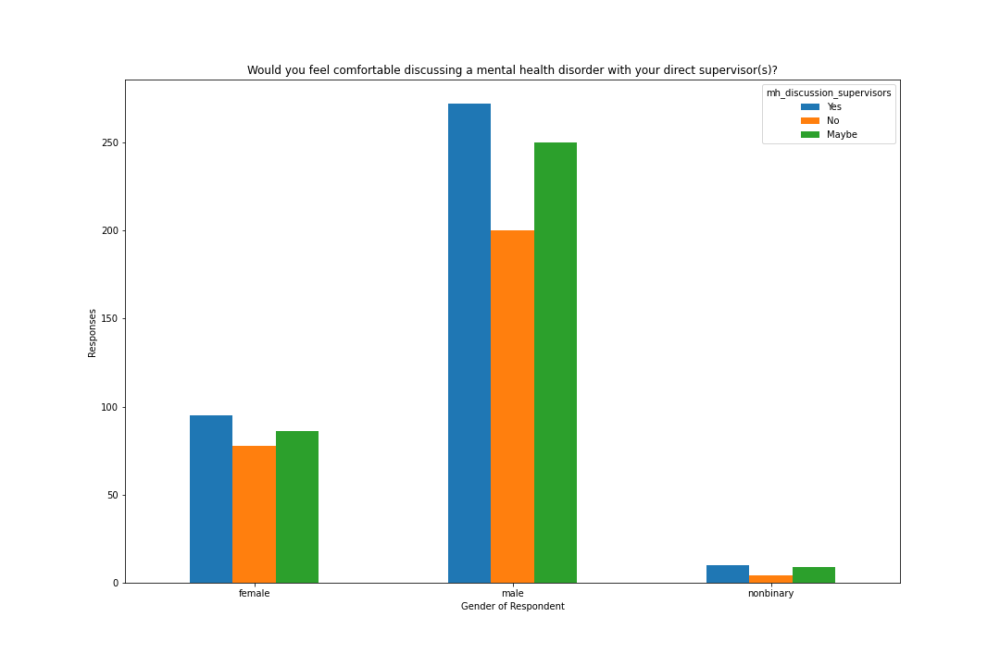
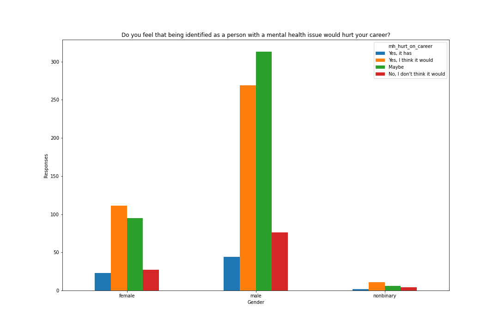
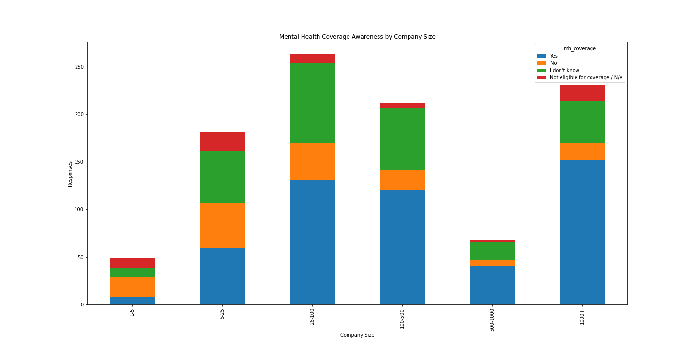
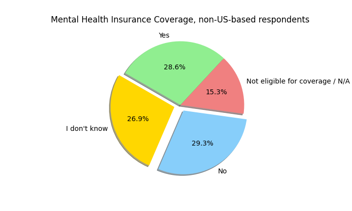
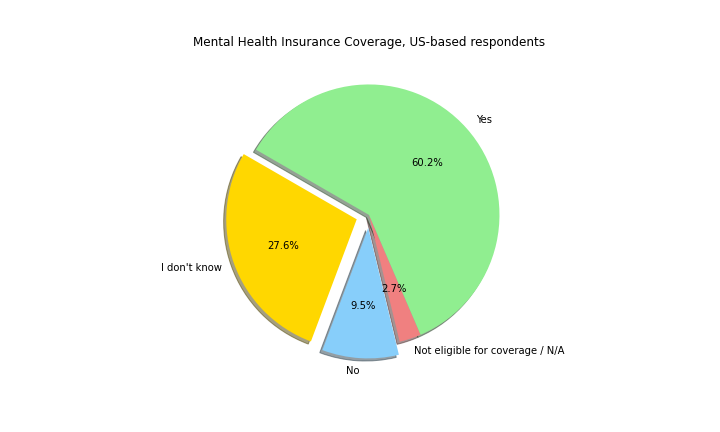
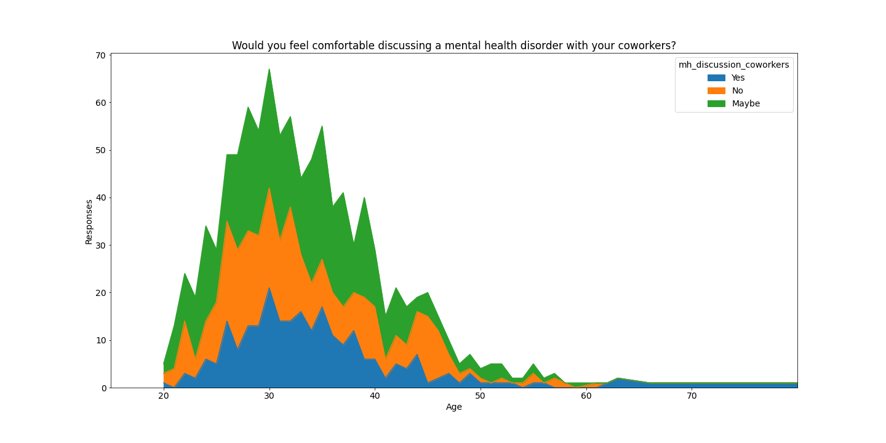

# Project Overview
Mental illness affects 1 out of every 5 adults. It costs the US about $1 trillion in lost productivity. Despite how common it is, people often avoid support. This analysis examines responses to mental health concerns in the technology industry, a market worth $1.6 trillion to ask: what factors contribute to a workplace that feels comfortable and receptive to employees with mental health concerns?

### Presentation:
[Google Slide Presentation](https://docs.google.com/presentation/d/1MGCToYm2dP9P64Vqa-BV66mx2AwQhjazQaETZNNopPo/edit?usp=sharing)

### Team Members : 
- Art Tucker : [branch](https://github.com/ArtTucker/mental_health_and_economics/tree/tucker_a_branch_01) 
- Preeti Suryakumar : [branch](https://github.com/ArtTucker/mental_health_and_economics/tree/preeti-01)
- Radhika Tippana : [branch](https://github.com/ArtTucker/mental_health_and_economics/tree/rtippana_segment_2)
- Sylvain Dessagnes : [branch](https://github.com/ArtTucker/mental_health_and_economics/tree/SylvainDessagnes_2nd_segment)
- Victoria Morales : [branch](https://github.com/ArtTucker/mental_health_and_economics/tree/morales_v_branch)
- Danielle Stauffer : [branch](https://github.com/ArtTucker/mental_health_and_economics/tree/Stauffer_Branch)

### Reason:
Many of us have battled with depression and anxiety issues for most of our lives. We are intimately aware of how these issues can be exacerbated by as well as lead to financial hardships. We wanted to further explore the statistics and numbers underpinning this relationship.

### Data Source:
We source our data from kaggle more specifically datasets including surveys focusing on individual working in tech-company. 
[Visit](https://github.com/ArtTucker/mental_health_and_economics/tree/main/resources) our resources.

# Methods
This data comes from Open Sourcing Mental Illness (OSMI), a nonprofit dedicated to raising awareness, educating, and providing resources to support mental wellness in the tech and open-source communities. The survey contains 1,434 responses, and measures attitudes towards mental health among tech workers with and without a mental health disorder. Our primary analysis of the dataset from 2016 (the year with the greatest number of respondents) included 1,004 responses, after data cleaning.
Data was filtered or dropped by these criteria:
1.	Dropped rows/respondents by people who work for a company, and are NOT self-employed
2.	Reduced rows/respondents by people who lived in countries where over 30 people contributed to the survey. 
3.	Removed columns/answers to survey questions with over 75% NaN entires.

# Analysis and Results
Most people identified as male in the survey. 722 respondents (72% of the total number of respondents) identified as male. 259 respondents (26% of the total number of respondents) identified as female. An exceedingly small group identified as non-binary (2%).
\
Most respondents said they felt comfortable talking about mental health with their supervisors. 95 women (37% of all female respondents) and 272 men (38% of all male respondents) affirmed that they would talk to their supervisor about mental health. This suggests people had similar levels of comfort discussing mental health issues, regardless of gender. However, ‘yes’, ‘no’, and ‘maybe’ responses were almost evenly split into thirds. This demonstrates people, overall, had distributive approaches.
\
***Figure A***

\
Despite some inclination to share about their mental health, almost half of all respondents believed that being identified as having a mental health diagnosis would hurt their career. 134 (52%) of women believed a mental health diagnosis either had or would hurt their career. Comparatively, 313 (43%) of men believed a mental health diagnosis either had or would hurt their career. Women feared retribution more than men in this scenario. 
\
***Figure B***
\

\
Nevertheless, when asked if they had observed co workers receiving negative consequences for revealing a mental health condition, almost 90% of both men and women said ‘no.’ Even though people feared for their careers if they were identified with a mental health condition, they also lacked any observable evidence of others receiving different treatment because of a mental health condition.
\
It also appeared respondents did not know if the workplace treated physical health and mental health the same. Just over 40% of men and women said, ‘I don’t know.’ 80 women (31% of female respondents) and 219 men (30% of male respondents) commented, ‘yes.’ Gender did not affect perception in this case. It could be implied that factors, such as uncertainty rather than observation of negative workplace practices, are influencing people and their choices about mental health in the workplace. 
\
When asked about awareness of mental health coverage, 412 (41%) of respondents answered, “I am not sure.” Most people, with no difference among men or women, did not know about their workplace’s coverage for mental health conditions. Employers also lacked efforts to spread awareness of available resources. 708 (71%) of respondents said their employers had not discussed mental health options. This perception did not vary by gender. 

**Additional Visualizations**:
\
***Mental health insurance coverage (and awareness of), by company size.***

\
***Mental health insurance coverage (and awareness of), in non-US countries, as % of total.***

\
***Mental health insurance coverage (and awareness of), in the US, as % of total.***

\
***Willingness to discuss mental health issues with coworkers, by age.***

to view additional analysis visualizations created so far, please visit our [images folder](https://github.com/ArtTucker/mental_health_and_economics/tree/main/images).

### Machine learning model:

Our intention is to predict an output from a previous experience, to achieve it, we will use a supervised machine learning model. 
This kind of model allow us to use training data to learn a link between the input, and the output. Compared to unsupervised learning, it is a more accurate and trustworthy method. 
- Datasource [Link.](https://github.com/ArtTucker/mental_health_and_economics/blob/main/database/filestoload/2016_surveydata.csv) 
  
- Goal: 

Our goal is to be able to classifies in an accurate manner if an individual is currently diagnosed with a Mental Health disorder according to each individual answers present in the dataset . 
Interest here is to focus on individuals who work in a tech-company. 
After training and testing our data, and if we add more answers, we will be able to predict an individual Mental Health disorder even if these entries are missing on the new data. 
  
- Data preprocessing: 

Couple steps have been necessary to obtained our desired features to plug-in into our machine learning model: 
** Filter our dataset to only keep answers for individual who work in a tech-company. 
** Re-code values entries in the age column. 
** Re-code values entries in the work-position column for consistency purpose. 
** Bins together values in the company-size column as some entries were not usable yet. 
** Re-code values entries in the medical-leave column for consistency purpose. 
** Clean gender column from duplicate ou incorrect entries. 
** Ensure answers consistency for mh-family-history, mh-sought-pro_tx, mh-dx-past, mh-coverage, prev-mh-benefits, prev-employers, country-live. 
** Create visualizations of cleaning step for better understanding of our features. 

Once we got all desired features cleaned up for our model, we encoded our data using a label encoder instance. This step allows us to change text values into unique numbers identifier and then use a machine learning algorithm on it.

- Features and targets engineering: 

Our target is: "Do you currently have a mental health disorder?"  
  
To predict it, we decided to use insights related to the target: 
** Demographics information: Age / Gender / Country where an individual live and works. 
** Company information: Size / Work position. 
** Current and previous employers' information: Provide MH benefits / Current employer / Previous employer. 
** Information about mental health disorder: Have been previously diagnosed with MH disorder / Able to take a leave if diagnosed with MH disorder / MH disorder from family history / Have been seeking help from  MH professional. 

- Description of training and testing sets: 

We decide to split our entry data into 75% for training set and 25% testing set, because any train-test split which has more data in the training set will most likely give you better accuracy as calculated on that test set. like that the training dataset for the model can learn and effectively map input to output. 
When splitting the dataset, we stratify it so that each split is similar. In a classification setting, it is often chosen to ensure that the train and test sets have approximately the same percentage of samples of each target class as the complete set.

- Model: 

As now, we are using a Random Forest Classifier because of his versatility, it can be used for both classifications and regression task. It provides higher accuracy through cross validation. Compared to simple decisions trees, instead of searching for the most important feature while splitting a node, it searches for the best feature among a random subset of features.
We will use it for his classification abilities. 

*Benefits:*
- Random forest builds multiple decision trees and merges them together to get a more accurate and stable prediction.
- It provides higher accuracy through cross validation. Random forest classifier will handle the missing values and maintain the accuracy of data.
- If there are more trees, it will lower the risk of over-fitting trees in the model.
- Robust to outliers.
- Works well with non-linear data.
- Better accuracy than other classification algorithms.(Example: Stochastic Gradient Descent/K-Nearest Neighbours/...) 

*Limitations:*
- The main limitation of random forest is that many trees can make the algorithm too slow and ineffective for real-time predictions.
- Since a random forest combines multiple decision trees, it becomes more difficult to interpret. 

To improve our classification we also run an oversampling model. It adjusts the class distribution of a data set (the ratio between the different classes/categories represented) by randomly duplicating examples from the minority class and adding them to the training dataset. Doing so should help to achieve a better predictions accuracy score.

- Model improvements, changes, additional training: 

To keep improving our model, we will keep refining our features and might add some more if it helps to boost our predictions accuracy.  
We stop using under-sampling as it did not help to improve our model. Indeed, under-sampling can result in dropping a lot of information. Even if this dropped information belongs to the majority class, it is useful information for a modeling algorithm. 

Our model is actually divided on 75% training data and 25% testing data. 
To train further our data, we are thinking about adding information into our training data out-of surveys answer's from a different year. More data will likely give us more accurate predictions since it will be trained on more information.

- Analyse of the Model: 

After using Random Forest Classifier to predict our target based on related features, our accuracy score is 78.6%, with a precision of 79%, a recall(sensitivity) of 79% and a F1 score of 0.79. 
The high average F1 score tell us that sensitivity and precision are balanced in our model. 
We can also analyse that our model have better performance while predicting a negative MH diagnostic than a positive one. 

After oversampling our accuracy score and all other parameters are better 83%, which is good and means our model is predicting more than 4 out of 5 times the correct output.

### Database:

For our project we use an SQL database, more specifically Postgres and pgadmin to interact with it. In our case, knowing that we are not going to work with a huge volumes of data, there are more advantages for us to use a relational database management system. We will also be hosting the database on AWS for public access.

For example:
- Data structure.
- Easy access to the network.
- Language (SQL).
- Speed.
- Maintenance.
- Ability to be access by more than one person.

Entity Relational Diagram [visit.]()

Using python package sqlalchemy, and the needed modules (create_engine/session) we build a database with our selected data and are able to preprocess it using python/pandas and then upload it into our database **Final_project_mental_health**, as well as imported it from the database into any python script we are working on.
We also can directly query the database in our pandas jupyter notebook using SQL code.
 

### Dashboard:

Our current plans for our dashboard will be an interactive Tableau page that will allow the viewer to explore how attitudes towards mental health concerns has changed in the workplace (if at all) over the course of the last five years.

# Summary
Without information, people make decisions based on personal biases, opinions or best guesses. Despite evidence to the contrary, workers believed that if an employer identified them with a mental health condition, then their careers would suffer. This felt more probable for women than men, a possible amplification of women’s minority status in the tech industry. Representing only 1 out every 4 workers, women already face different characterizations than men, because of their poorer remonstrance. While workers had not seen negative consequences for a mental health diagnosis among coworkers, they also did not notice employers spreading awareness of mental health resources or coverage. Omission in discussions prevents normalization of the subject. It could be affecting people’s willingness to be identified as having a mental health condition. Even for this survey, only 420 (41%) of the total respondents were willing to answer if they had a current mental health diagnosis.

# Recommendations for Employers
1.	Amplify communication about wellness opportunities to prevent stress from becoming a mental health condition. Normalize mental health by openly discussing it during presentations about resources and health coverage.
2.	Acknowledge and name gender dynamics in the workplace. Women perceive penalization is possible more often than men. More research is needed to understand why, but it starts by naming that men outnumber women dramatically.
3.	Workplace culture is affected by many factors. Psychological safety affects people’s productivity and retention, which has financial consequences. Do right by people. Do right by your bottom line. Consider a corporate social responsibility department. Incorporate data about employee wellness into a part of how the workplace success is defined. Measure it so there’s accountability.
4.	The world is in the middle of a health care crisis. Unfortunately, the Covid 19 pandemic represents only part of a larger story. Anxiety and depression are also on the rise. People cannot find the help that they need to address these mental health conditions. According to an American Psychological Association poll of nearly 1,800 psychologists, 74 percent said more patients were seeking treatment for anxiety disorders than before the pandemic. Nearly 30 percent of providers reported seeing more patients overall (New York Times, 2021). Employers can and must step up to meet this crisis. It is about changing how and what we communicate regarding mental health services to staff in order to maintain or improve business operations.

