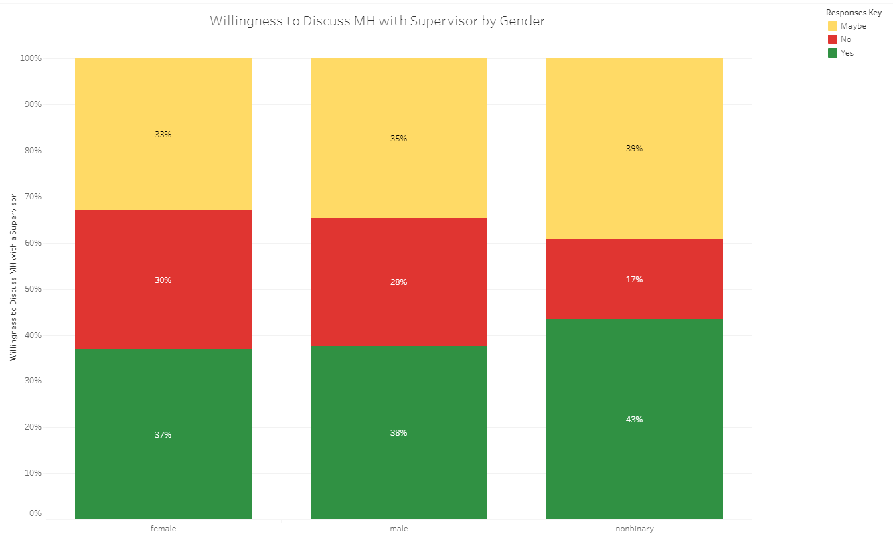
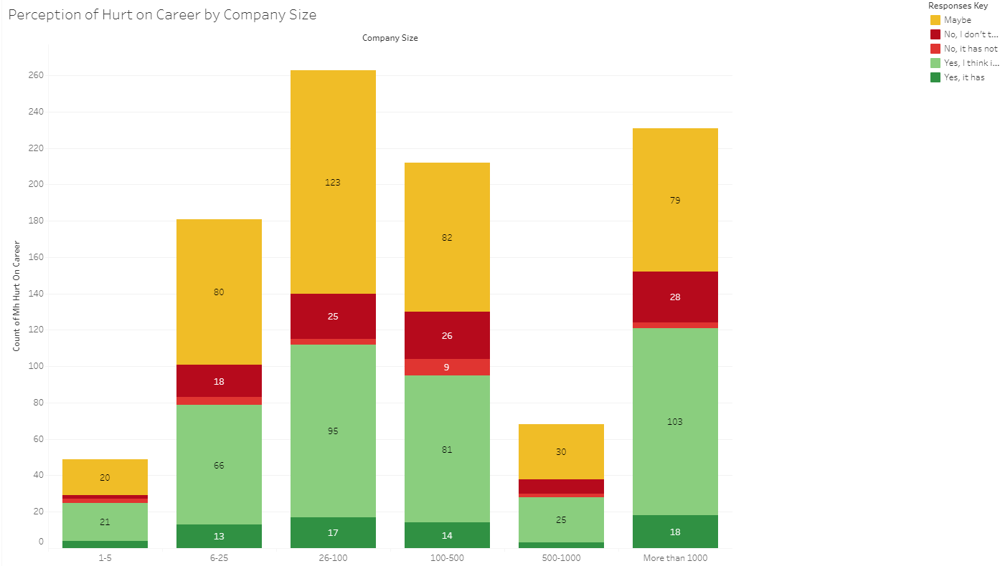
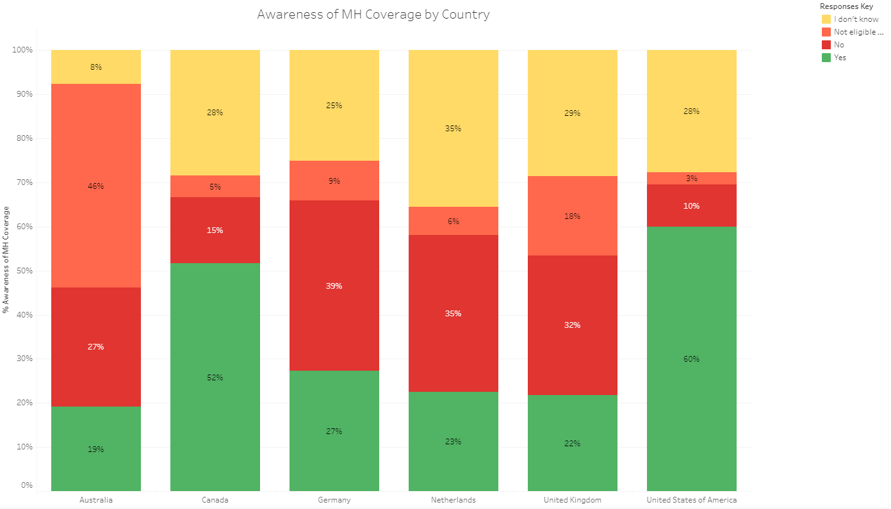

# Project Overview
Mental illness affects 1 out of every 5 adults. It costs the US about $1 trillion in lost annual productivity. Despite how common this condition is, people often avoid seeking support. This analysis examines the technology industry, a market worth $1.6 trillion to ask: what factors can contribute to creating an employee workplace that feels comfortable and receptive to mental health support?
 
# Reason:
The world is in the middle of a health care crisis. Unfortunately, the Covid 19 pandemic represents only part of a larger story. Anxiety and depression are also on the rise. People cannot find the help that they need to address these mental health conditions. According to an American Psychological Association poll of nearly 1,800 psychologists, 74 percent said more patients were seeking treatment for anxiety disorders than before the pandemic. Nearly 30 percent of providers reported seeing more patients overall (New York Times, 2021). Research that identifies the need for employers to step up to meet this crisis will affect policy and lives. This study is important for showing how and what we communicate regarding mental health services to staff can influence the maintenance and/ or improvement of business operations.

### Team Members: 

- Art Tucker : [branch](https://github.com/ArtTucker/mental_health_and_economics/tree/tucker_a_branch_01) 
- Preeti Suryakumar : [branch](https://github.com/ArtTucker/mental_health_and_economics/tree/preeti-01)
- Radhika Tippana : [branch](https://github.com/ArtTucker/mental_health_and_economics/tree/rtippana_segment_2)
- Sylvain Dessagnes : [branch](https://github.com/ArtTucker/mental_health_and_economics/tree/SylvainDessagnes_2nd_segment)
- Victoria Morales : [branch](https://github.com/ArtTucker/mental_health_and_economics/tree/morales_v_branch)
- Danielle Stauffer : [branch](https://github.com/ArtTucker/mental_health_and_economics/tree/Stauffer_Branch)

# Data Source/ Pre-Processing
This data comes from Open Sourcing Mental Illness, a nonprofit dedicated to raising awareness, educating, and providing resources to support mental wellness in the tech and open-source communities. The survey for the year 2016 contains 1,434 responses, and measures attitudes towards mental health among tech workers with and without a mental health disorder. The analysis included 1,004 responses after data cleaning.
Data was filtered or dropped by these criteria:
1.	Dropped rows/respondents by people who work for a company, and are NOT self-employed
2.	Reduced rows/respondents by people who lived in countries where over 30 people contributed to the survey. 
3.	Removed columns/answers to survey questions with over 75% NaN
4.	Re-code values entries in the age column.
5.	Re-code values entries in the work-position column for consistency purpose.
6.	Bins together values in the company-size column as some entries were not usable yet.
7.	Re-code values entries in the medical-leave column for consistency purpose.
8.	Re-code gender column to address inconsistent entries.
9.	Ensure answers consistency for mh-family-history, mh-sought-pro_tx, mh-dx-past, mh-coverage, prev-mh-benefits, prev-employers, country-live.

\
Pandas/Python supported this pre-processing of information.

# Database
To host information and ensure public access across 6 members, Amazon Web services hosts the information. An SQL relational database creates tables and links them by primary and foreign keys across years. Postgres and pgadmin best suited the project because the survey only contains about a 1000 records. Other benefits included:
\
- Data structure.
- Easy access to the network.
- Language (SQL).
- Speed.
- Maintenance.
- Ability to be access by more than one person.
\
Please [visit](database/Database_ERD2.png) Entity Relational Diagram for details about table structure.
\
\
To load the data into the tables, we used a python package, sqlalchemy, and modules, such as create engine/session.  From the built database, “Final_Project:_Mental_Health”, it is possible to directly query the data into a pandas jupyter notebook using SQL code.
\
\
Datasource [Link.](database/filestoload/2016_surveydata.csv) 

# Results
**Characteristics of Respondents**
\
Analysis examined gender, age, country-worked, and company size’s influence on people’s perception of mental health resources and stigma in the workplace. Most survey respondents identified as male. 722 respondents (72% of the total number of respondents) identified as male. 259 respondents (26% of the total number of respondents) identified as female. An exceedingly small group identified as non-binary (2%). Between 25%-75% of workers fell in the age range of 28-38. The United States and Britain accounted for 842(84%) of the survey respondents’ country of work. Respondents came from companies of various sizes; the most popular being companies of 26-100 people or 1000+ people.
\
\
**Comfort Discussing Mental Health with a Supervisor**
\
Most respondents said they felt comfortable talking about mental health with their supervisors. Across gender, country, age and company size, ‘yes’, ‘no’, and ‘maybe’ responses were in the exact same proportions, and almost evenly split into thirds (34% ‘maybe’, 28% ‘no’, and 38% ‘yes’). This demonstrates people, overall, had distributive approaches. The only variable that showed notable differences was country-worked. 56% of respondents who worked in the Netherlands said ‘yes,’ they felt comfortable discussing mental health with a supervisor. Contrarily, only 16% of respondents who worked for companies in Germany felt similarly. Nevertheless, merely 31 respondents worked in the Netherlands and 44 respondents worked in Germany. Since the most respondents came from Britain and the US, these countries’ 842 respective responses of 40% and 38% ‘yes’ affected the overall results for ‘country-worked.’
\
\
**Figure A**

\
\
**Perception that Identification of Having a Mental Illness Would Hurt a Career**
\
Despite some inclination to share about their mental health, almost half of all respondents believed that being identified as having a mental health diagnosis would hurt their career. Women feared retribution more than men in this scenario. 134 (52%) of women believed a mental health diagnosis either had or would hurt their career. Comparatively, 313 (43%) of men believed a mental health diagnosis either had or would hurt their career. Canadian workers also felt the most concerned in comparison to workers of other countries. 62% of the 60 workers in Canadian companies said they thought being identified with a mental illness had or would affect their career. On the other hand, only 11 respondents from the Netherland companies thought this. Size of company also made a small difference. Half of respondents from companies with more than 1000 workers thought being identified with a mental illness would hurt their careers. Conversely, only 44% of respondents thought this was true for a company of 100-500 people. Identification with a mental illness showed some of the greatest variances among subgroups’ (e.g. men vs women) responses even while the overarching categories (gender vs age) showed similarities in answers.

\
***Figure B***
\

\
It also appeared respondents did not know if the workplace treated physical health and mental health the same. Just over 40% of men and women said, ‘I don’t know.’ 80 women (31% of female respondents) and 219 men (30% of male respondents) commented, ‘yes.’ Gender did not affect perception in this case. It could be implied that factors, such as uncertainty rather than observation of negative workplace practices, are influencing people and their choices about mental health in the workplace. 
\
\
**Observation of Negative Consequences for a Coworker Revealing Mental Illness**
\
Nevertheless, when asked if they had observed coworkers receiving negative consequences for revealing a mental health condition, almost 90% of both men and women said ‘no.’ 91% of people, regardless of country-worked also said ‘no’. 91% of people from every company size said no. For age, less than 10% of people also said ‘yes’ to seeing consequences. Even though people feared for their careers if they were identified with a mental health condition, they also lacked any observable evidence of others receiving different treatment because of a mental health condition.
\
\
**Belief that Mental Health and Physical Health Receive the Same Regard**
\
It also appeared respondents did not know if the workplace treated physical health and mental health the same. Just over 40% of men and women said, ‘I don’t know.’ 80 women (31% of female respondents) and 219 men (30% of male respondents) commented, ‘yes.’ Gender did not affect perception in this case. Younger workers seemed to show the most confusion around this subject with 48% saying “I don’t know” in comparison to 39% of workers ages 38 or more. As people aged, they seemed to shift more towards “no” than “yes”, and away from “I don’t know.” It could be implied that factors, such as uncertainty rather than observation of negative workplace practices, are influencing people and their choices about mental health in the workplace. Workers see this as they are in the workforce longer, but it is unclear to most people regardless of company size, country, etc.
\
\
**Awareness of Mental Health Coverage and Employer’s Discussion of Mental Health**
\
When asked about awareness of mental health coverage, 412 (41%) of respondents answered, “I am not sure.” Most people did not know about their workplace’s coverage for mental health conditions regardless of gender, age, company size or country-worked. Employers also lacked efforts to spread awareness of available resources. 708 (71%) of respondents said their employers had not discussed mental health options. This perception also did not vary by a set of characteristics. 
\
\
**Figure C**
\

 
# Dashboard
Please see charts and results in an interactive form on our website here: https://www.mentalhealthintech.com/

[Click here](https://public.tableau.com/profile/radhika3898#!/vizhome/MentalHealthinTechIndustry_16206129261670/CountryMap "Link to Dashboard")
to see the interactive dashboard in Tableau.

# Machine Learning Model:
**Model Type and Goal**
\
A supervised learning model helps to predict an output from a previous experience. It works by training data and learning from a link between an input and output. Our goal was to classify if an individual is currently diagnosed with a Mental Health disorder among all respondents.
\
\
**Target and Features Engineering**
\
Our target is: "Do you currently have a professional mental health diagnosis?"
\
To predict it, we identified insights related to the target:
- Demographics information: Age / Gender / Country where an individual live and works.
- Company information: Size / Work position.
- Current and previous employers' information: Provide MH benefits / Current employer / Previous employer.
- Information about mental health disorder: Have been previously diagnosed with MH disorder / Able to take a leave if diagnosed with MH disorder / MH disorder from family history / Have been seeking help from MH professional.
\
\
**Test and Train Set Up**
\
After data pre-processing, we encoded our data using a label encoder instance. This changed text values into numbers, which is required for a machine learning algorithm to work. Next, the data was split: 25% into a ‘testing’ set and 75% into ‘train’ set. For classification, it is important that the ‘train’ and ‘test’ sets have approximately the same percentage of samples of each target class as the complete set. Stratification ensured this occurred. The decision to put more data in ‘train’ than ‘test’ facilitated better accuracy. Accuracy increases when the ‘train’ set contains more data than the ‘test set’, because the score calculates on the ‘test’ set. 
\
\
**Random Forest Classifier: Pros and Limitations**
\
This analysis employed a Random Forest Classifier because of its versatility. A Random Forest Classifier can be used for both classifications and logistic regression. It also provides higher accuracy through cross validation. Compared to some simple decision trees, which searches for the most important feature while splitting a node, a Random Forest Classifier finds the best feature among a random subset of features. The pros and cons of this model are represented below.
\
\
*Benefits:*
- Random Forest Classifiers build multiple decision trees and merges them together to get a more accurate and stable prediction.
- It provides higher accuracy through cross validation.  A Random Forest Classifier will handle the missing values and maintain the accuracy of data.
- If there are more trees, it will lower the risk of over-fitting trees in the model.
- Robust to outliers.
- Works well with non-linear data.
- Better accuracy than other classification algorithms. (Example: Stochastic Gradient Descent/K-Nearest Neighbors/...)
\
*Limitations:*
- The main limitation of a Random Forest is that many trees can make the algorithm too slow and ineffective for real-time predictions.
- Since a Random Forest combines multiple decision trees, it becomes more difficult to interpret.
\
\
**Model Improvements, Changes, Additional Training**
\
To improve our classification, we also ran an oversampling model. It adjusted the class distribution of a data set (the ratio between the different classes/categories represented) by randomly duplicating examples from the minority class and adding them to the training dataset. Doing so should help to achieve a better predictions accuracy score.
To keep improving our model, the next step would be to keep refining our features. For example, we could add some more features if it boosts the prediction’s accuracy. We stopped using under-sampling as it did not help to improve our model. Under-sampling probably did not work because it drops a lot of information. More information helps the modeling algorithm.  
\
\
**Results**
\
After using Random Forest Classifier to predict our target based on related features, our accuracy score is 78.6%, with a precision of 79%, a recall(sensitivity) of 79% and a F1 score of 0.79. The high average F1 score tell us that sensitivity and precision are balanced in our model. We can also analyze that our models have better performance while predicting a negative MH diagnostic than a positive one.
After oversampling, our accuracy score and all other parameters are better than 83%, which is good and means our model is predicting more than 4 out of 5 times the correct output.

## **Model Type and Goal**
\
Using Supervised learning , we also attempt using Logistic Regression as a model to predict seeking treatment as a target. It works by training data and learning from a link between an input and output. 
\
\
**Target and Features Engineering**
\
Our target is: "Have you ever sought treatment for a mental health issue from a mental health professional?"
\
To predict it, we identified insights related to the target:
- Demographics information: Age / Gender / Country where an individual lives.
- Company information: Size 
- Current employers' information: Employer provided health benefit/ awarenes of MH coverage benefits/MH resources provided/ Anonimity maintained if you have a MH     condition
- Information about mental health disorder: Have been diagnosed with a MH disorder by a professional/ Do you currently have a diagnosis /Will there be a negative impact with discussing yor MH condition/ can you discuss your condition with coworkers or direct supervisors or employer/ Have you observed consequences if you discuss your condition with coworkers/ is mental health condition perceived like a physical health condition/
\
**Test and Train Set Up**
\
After data pre-processing, we encoded our data using a label encoder instance. This changed text values into numbers, which is required for a machine learning algorithm to work. Next, the data was split: 25% into a ‘testing’ set and 75% into ‘train’ set. For classification, it is important that the ‘train’ and ‘test’ sets have approximately the same percentage of samples of each target class as the complete set. Stratification ensured this occurred. The decision to put more data in ‘train’ than ‘test’ facilitated better accuracy. Accuracy increases when the ‘train’ set contains more data than the ‘test set’, because the score calculates on the ‘test’ set. 
\
\
**Logistic Regression: Pros and Limitations**
\
This analysis employed a Logistic Regression along with Random Forest Classfier.  The pros and cons of this model are highlighted below.
\
*Benefits:*
- Probability Prediction
  Compared to some other machine learning algorithms, Logistic Regression will provide probability predictions and not only classification labels (think kNN).
- Thrives with Little Training
  One of the great advantages of Logistic Regression is that when you have a complicated linear problem and not a whole lot of data it's still able to produce pretty useful predictions. This is a pro that comes with Logistic Regression's mathematical foundations and won't be possible with most other Machine Learning models.
- Efficient Computation
  Logistic Regression is not a resource hungry model (unlike many others, think NNs, SVM, kNN) and this makes it suitable for some simple applications.
- Unlikely to Overfit
  Logistic Regression won't overfit easily as it's a linear model. Especially with the C regularization parameter in scikitlearn you can easily take control of any overfitting anxiety you might have.
- Good accuracy for many simple data sets and it performs well when the dataset is linearly separable.

*Limitations:*
- Limited Use Case
 Logistic Regression is strictly a classification method and it has lots of competition(SVMs, Naive Bayes, Random Forests, kNN) which have better application with complex data
- Linear Decision Boundary
 Logistic Regression inherently runs on a linear model. This means even more restriction when it comes to implementing logistic regression especially if your data has multiple non-linear aspects (e.g Yes,No,Maybe in our dataset)
- Can't Handle Missing Data
 Logistic Regression is not immune to missing data unlike some other machine learning models such as decision trees and random forests which are based on trees.
\
\
**Results**
\
After using Logistic Regression to predict our target based on related features, our accuracy score is 876.9%, with a precision of 97%, a recall(sensitivity) of 81% and a F1 score of 0.88. The high average F1 score tell us that sensitivity and precision are balanced in our model. We can state that our models has a good (almost too good) performance while predicting " someone will seek professional help", based on our factors.
After attempts with different inputs our accuracy score and all other parameters are better than 80%, which is good and means our model is predicting well that people will seek professional help to manage their mental health condition.With our limited data of 1004 responses to the survey, we can say using logistic regression, we can predict that a professional will seek professional help with the above stated input variables. We could potentially use this model for promoting safe practices around mental health conditions to decrease the stigma allowing professionals to comfortable talk to their peers , direct supervisors and seek professional help.
\

# Summary
Without accurate information, people make decisions based on personal biases, opinions or best guesses. Despite evidence to the contrary, workers believed that if an employer identified them with a mental health condition, then their careers would suffer. This felt more probable for women than men, a possible amplification of women’s minority status in the tech industry. Representing only 1 out every 4 workers, women already face different characterizations than men, because of their poorer remonstrance. While workers had not seen negative consequences for a mental health diagnosis among coworkers, they also did not notice employers spreading awareness of mental health resources or coverage. Omission in discussions prevents normalization of the subject. This could be affecting people’s willingness to be identified as having a mental health condition. Even for this survey, only 420 (41%) of the total respondents were willing to answer if they had a current mental health diagnosis.
\
\
**Presentation:**
\
Please see more of our presentation and summary in [Google Slides](https://docs.google.com/presentation/d/1MGCToYm2dP9P64Vqa-BV66mx2AwQhjazQaETZNNopPo/edit?usp=sharing)

# Recommendations for Employers
1.	Amplify communication about wellness opportunities to prevent stress from becoming a mental health condition. Normalize mental health by openly discussing it during presentations about resources and health coverage.
2.	Acknowledge and name gender dynamics in the workplace. Women perceive penalization is possible more often than men. More research is needed to understand why, but it starts by naming that men outnumber women dramatically.
3.	Workplace culture is affected by many factors. Psychological safety affects people’s productivity and retention, which has financial consequences. Do right by people. Do right by your bottom line. Consider a corporate social responsibility department. Incorporate data about employee wellness into a part of how the workplace success is defined. Measure it so there’s accountability.
